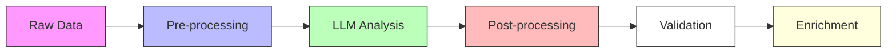

# Analysis Process

## Overview

The analysis process transforms raw search results into actionable business signals. This is a critical stage where:
- Raw text is converted to structured data
- Business relevance is determined
- Signals are classified and scored
- Results are enriched with context

## Process Stages



### 1. Pre-processing
Prepare data for analysis:

```python
class PreProcessor:
    """
    Prepares raw data for LLM analysis.
    
    Why this matters:
    - Clean data improves LLM accuracy
    - Structured input ensures consistent analysis
    - Proper formatting reduces token usage
    
    Example usage:
        processor = PreProcessor(config)
        clean_data = await processor.process(raw_data)
    """
    
    async def process(self, data: Dict[str, Any]) -> Dict[str, Any]:
        """
        Process raw data through cleaning pipeline.
        
        Steps:
        1. Text normalization
        2. Content extraction
        3. Format standardization
        4. Length optimization
        """
        return {
            'text': self._clean_text(data['content']),
            'metadata': self._extract_metadata(data),
            'context': self._build_context(data)
        }
```

### 2. LLM Analysis
Core analysis using language models:

```python
class SignalAnalyzer:
    """
    Analyzes text for business signals using LLM.
    
    Key features:
    1. Multi-stage analysis
    2. Context-aware processing
    3. Confidence scoring
    4. Signal classification
    
    Example:
        analyzer = SignalAnalyzer(model_config)
        signals = await analyzer.analyze(clean_data)
    """
    
    async def analyze(self, 
                     data: Dict[str, Any],
                     context: Optional[Dict] = None) -> List[Dict[str, Any]]:
        """
        Perform multi-stage signal analysis.
        
        Process:
        1. Initial signal detection
        2. Detailed analysis of potential signals
        3. Confidence scoring
        4. Classification
        
        Note: Each stage can retry independently on failure
        """
        try:
            # Stage 1: Signal Detection
            potential_signals = await self._detect_signals(data['text'])
            
            # Stage 2: Detailed Analysis
            analyzed_signals = []
            for signal in potential_signals:
                if signal['confidence'] >= self.min_confidence:
                    detailed = await self._analyze_signal(signal, context)
                    analyzed_signals.append(detailed)
            
            return analyzed_signals
            
        except LLMError as e:
            # Handle LLM-specific errors
            logging.error(f"LLM Analysis failed: {str(e)}")
            raise
```

### 3. Post-processing
Refine and structure analysis results:

```python
class PostProcessor:
    """
    Processes and structures LLM analysis results.
    
    Features:
    1. Result validation
    2. Data structuring
    3. Score normalization
    4. Duplicate merging
    
    Why important:
    - Ensures consistent output format
    - Improves result quality
    - Enables reliable downstream processing
    """
    
    def process_results(self, 
                       results: List[Dict[str, Any]]) -> List[Dict[str, Any]]:
        """
        Process and structure analysis results.
        
        Steps:
        1. Validate result format
        2. Normalize confidence scores
        3. Merge similar signals
        4. Apply business rules
        """
        processed = []
        for result in results:
            if self._validate_result(result):
                normalized = self._normalize_scores(result)
                structured = self._structure_data(normalized)
                processed.append(structured)
        
        return self._merge_similar(processed)
```

## Quality Control

### 1. Validation Rules
Define quality standards:

```python
validation_config = {
    'confidence_threshold': 0.7,
    'required_fields': [
        'signal_type',
        'company_name',
        'event_details',
        'timeline'
    ],
    'score_weights': {
        'relevance': 0.4,
        'confidence': 0.3,
        'completeness': 0.3
    }
}
```

### 2. Quality Metrics
Monitor analysis quality:

```python
class QualityMonitor:
    """
    Monitors analysis quality metrics.
    
    Metrics tracked:
    1. Accuracy (via sampling)
    2. Confidence distribution
    3. Processing success rate
    4. Result completeness
    
    Why monitoring matters:
    - Detect quality degradation early
    - Identify areas for improvement
    - Maintain high signal quality
    """
    
    def calculate_metrics(self, 
                        results: List[Dict[str, Any]]) -> Dict[str, float]:
        """
        Calculate quality metrics for results.
        
        Metrics:
        - Average confidence
        - Completion rate
        - Error rate
        - Processing time
        """
        return {
            'avg_confidence': self._calc_confidence(results),
            'completion_rate': self._calc_completion(results),
            'error_rate': self._calc_error_rate(results),
            'processing_time': self._calc_processing_time(results)
        }
```

## Prompt Structure

### Anatomy of an Effective Prompt

A well-structured prompt consists of several key components:

1. **Role Definition**
   ```python
   """
   You are a B2B sales and marketing specialist in [industry].
   Your expertise includes [specific areas].
   """
   ```
   - Defines LLM's expertise domain
   - Sets context for analysis
   - Focuses on specific industry knowledge

2. **Task Description**
   ```python
   """
   Your task is to analyze [content type] to identify [specific signals].
   Key characteristics of target signals:
   - Signal type A: [description]
   - Signal type B: [description]
   """
   ```
   - Clear objective statement
   - Specific signal definitions
   - Explicit success criteria

3. **Analysis Framework**
   ```python
   """
   Key Analysis Points:
   1. Content scope: [what to analyze]
   2. Entity extraction: [what to look for]
   3. Qualification criteria: [how to evaluate]
   4. Exclusion rules: [what to ignore]
   """
   ```
   - Structured analysis approach
   - Clear evaluation criteria
   - Explicit exclusion rules

4. **Response Format**
   ```python
   """
   Return results as Python list:
   [
       "entity_name",      # Company or organization
       signal_strength,    # Numerical score
       "revenue_range",    # Standardized range
       "summary",         # Brief overview
       "notes",          # Analysis details
       "context"         # Source context
   ]
   """
   ```
   - Strict format definition
   - Type specifications
   - Field descriptions

### Example Implementation

```python
class PromptBuilder:
    """
    Builds analysis prompts from components.
    
    Key features:
    1. Modular prompt construction
    2. Template customization
    3. Format validation
    4. Example integration
    
    Example usage:
        builder = PromptBuilder(industry='warehouse_tech')
        prompt = builder.build_prompt(target='motion_sensors')
    """
    
    def build_prompt(self, 
                    target: str,
                    custom_rules: Optional[Dict] = None) -> str:
        """
        Construct complete analysis prompt.
        
        Components:
        1. Role and expertise
        2. Task definition
        3. Analysis framework
        4. Response format
        5. Examples
        """
        return f"""
        {self._get_role_definition()}
        
        {self._get_task_description(target)}
        
        {self._get_analysis_framework(custom_rules)}
        
        {self._get_response_format()}
        
        {self._get_examples()}
        """
```

### Best Practices

1. **Signal Definition**
   - Be specific about what constitutes a signal
   - Include both positive and negative examples
   - Define clear qualification criteria

2. **Context Management**
   - Provide industry-specific context
   - Include relevant business rules
   - Define scope and limitations

3. **Format Control**
   - Use strict output formatting
   - Define data types explicitly
   - Include validation rules

4. **Example Quality**
   - Provide diverse examples
   - Include edge cases
   - Show both good and bad matches

### Quality Metrics

```python
prompt_quality_metrics = {
    'clarity': {
        'role_definition': 0.0,  # 0-1 score
        'task_description': 0.0,
        'analysis_framework': 0.0
    },
    'completeness': {
        'required_components': [],
        'example_coverage': 0.0,
        'validation_rules': 0.0
    },
    'effectiveness': {
        'signal_accuracy': 0.0,
        'noise_reduction': 0.0,
        'processing_efficiency': 0.0
    }
}
```

## Related Topics
- [Prompt Structure Guide](../prompts/structure.md)
- [LLM Integration](../prompts/llm.md)
- [Quality Metrics](../performance/metrics.md)
- [Error Handling](../troubleshooting/common-issues.md)